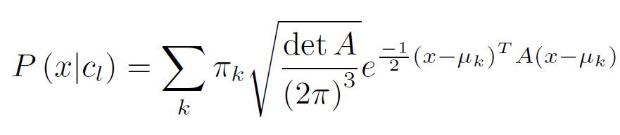
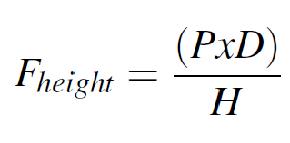
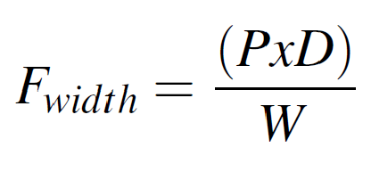
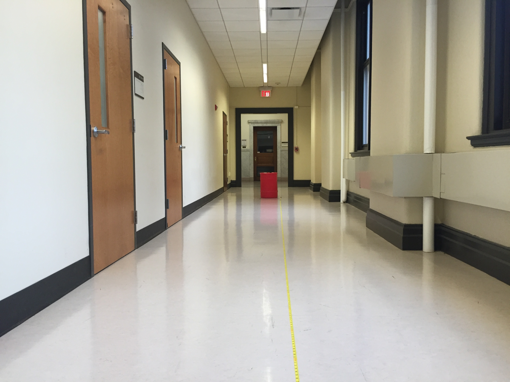

Color-Segmentation-using-GMM
============================

In this project, I have implemented an approach for robust color segmentation which was further used to detect a red barrel based on shape statistics. The different color representations of red barrel contain variations in illumination, occlusion and tilt. This is the reason Gaussian Mixture Models was used to represent these variations.

# Expectation-Maximization Algorithm
The expectation maximization algorithm is used to find out the mean, variances and weights in the of the different Gaussian Models that represent the red barrels in the training images.

The GMM is represented by -

# Barrel Detection
After the red regions of the barrel had been segmented, to connect the known regions Contours were used. Contours connect similar points (having similar intensity or color values.

Parameter Estimation is done by using the formula: The values were calculated and estimated by averaging from these 2 formulas:

| Vertical FoV | Horizontal FoV |
| ----------- | ----------- |
|  |  |

# Results

| Test Images | Segmentation | Barrel Detection |
| ----------- | ----------- | ----------- |
|  |  |  
|  |  |  
|  |  |  
|  |  | 
|  |  |   
|  |  | 
|  |  |  

# Instructions
Place the test images in "Test Images"

* Run em.py to find out the optimal values for Mean, Variance and Weights and to Detect Barrels. 
	Outputs of EM will be in folder --> 'EM Output' 

	NOTE - You may need to run this more than once, sometimes it gives NaN values dueto random initialization.

* Run calculateBarrelmeasures.py to calulate Barrel Box, Centroid and Distance. 
	Outputs of Bounding Box and distance and height --> 'Final Output'
